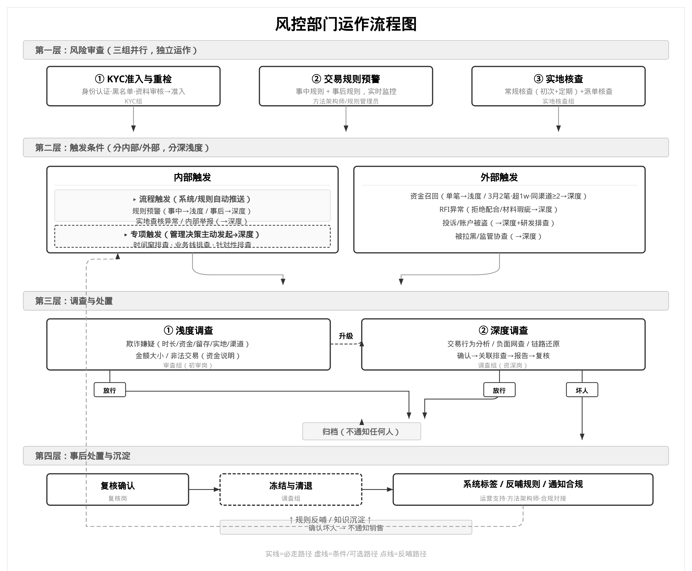
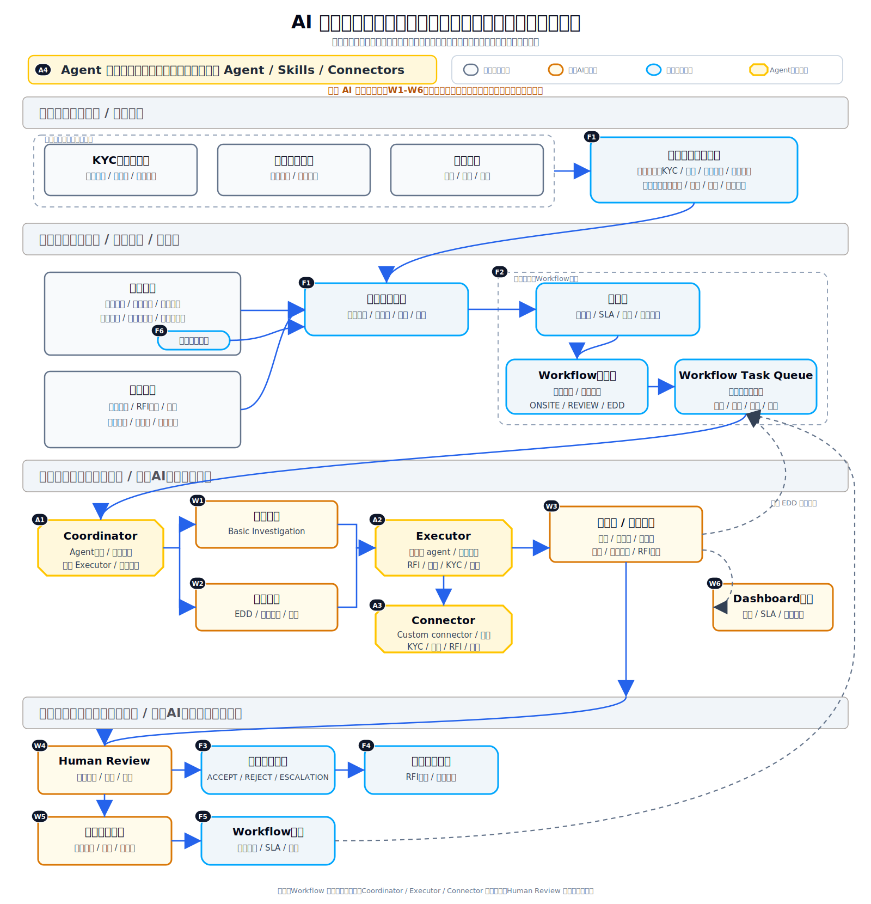
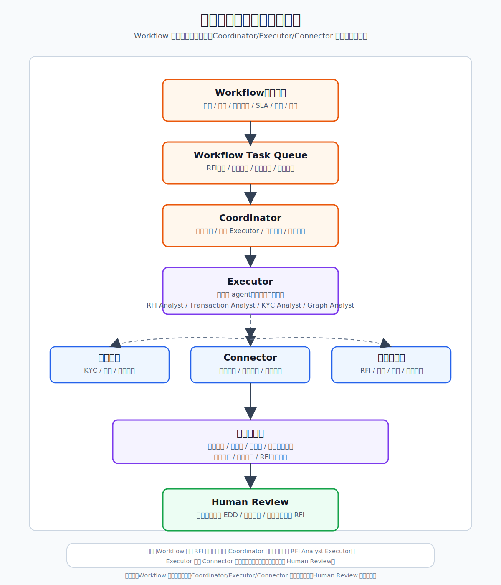

# AI 案件调查自动化系统架构

## 1. 客户原始流程图

## 2. 系统模块承载图

这张图以客户原始四层业务流程为基线。新增系统模块用于承载原流程，不是另起一套替代流程。

图中用三类交付范围标注项目 scope。灰色客户原有能力只作为接入对象和业务上下文，不作为本次交付类别。

| 交付类别 | 使用者 | 覆盖范围 |
| --- | --- | --- |
| 案件流程系统平台 | 业务用户间接使用，流程/系统管理员配置 | 承载案件接入、案件池、Workflow、Task Queue、状态流转、SLA、处置、后续任务和审计回写 |
| Agent 工程平台 | AI 工程师、平台工程师、数据/后端工程师、技术管理员 | 技术人员在这里建设和治理 Agent、Skills、Connectors、Evaluation、权限、发布和监控 |
| 业务 AI 工作台 | 风控操作员、复核人员、风控管理者、策略组 | 业务人员在这里用 AI 完成案件调查、复核、处置建议、RFI 草稿、反馈和复盘 |

图中的黑色标签对应本项目需要改造或新增的具体范围，不对 KYC、交易规则预警、实地核查、内部触发、外部触发等现有接入对象编号。标签前缀表示交付类别：`F` 表示案件流程系统平台，`A` 表示 Agent 工程平台，`W` 表示业务 AI 工作台。

图形规则：客户原有模块保留原有形状和颜色；业务 AI 工作台使用客户原有形状但换成 AI 增强色；Agent 工程平台使用切角形状和 Skyee 黄色；案件流程系统平台使用圆角形状和 Skyee 蓝色。

### 2.1 案件流程系统平台

案件流程系统平台承载案件流入、任务流转、状态推进、SLA、处置、后续任务和审计回写。业务人员会间接使用它，但它不是 AI 工作台。

- F1 案件来源适配器：承接 KYC、规则、实地核查、举报、专项、RFI、离线规则、图谱关联等来源。
- F2 案件接入层：负责触发归一、标准化、去重、归并和建案。
- F3 案件池：承载优先级、SLA、队列、分派入口和案件级视图。
- F4 Workflow 编排层：负责状态流转、节点审批、权限、SLA 和审计。
- F5 Workflow Task Queue：承载可执行任务队列。
- F6 处置流转模块：承载 ACCEPT、REJECT、ESCALATION 的系统流转、权限和审计。
- F7 后续任务模块：承载 RFI 回应、策略反馈等后续任务。
- F8 Workflow 回写：回写状态关闭、SLA 和审计记录。
- F9 关联图谱触发：作为内部触发的一类，将主体、账户、交易、渠道和历史风险之间的关联命中转成案件流入信号。

### 2.2 Agent 工程平台

Agent 工程平台面向 AI 工程师、平台工程师、数据/后端工程师和技术管理员，为技术团队提供 Agent、Skills、Connectors 的建设、测试、发布和治理能力。偏技术的 Agent、Skill、Connector、Evaluation 和发布治理在这里完成。

- A1 Coordinator：负责 Agent 调度、执行控制、Executor 选择和输出聚合。
- A2 Executor：以岗位化 agent 执行调查任务。
- A3 Connector：为 Executor 提供 custom connector、权限和受控数据/工具访问。
- A4 Agent / Skill / Connector 工程治理能力：支持建设、测试、发布、权限、评估、监控和版本治理。

### 2.3 业务 AI 工作台

业务 AI 工作台面向风控操作员、复核人员、风控管理者和策略组。它不是单个 skill，而是业务人员使用 Agent 能力完成案件调查、复核、处置建议、反馈和复盘的工作入口。

在系统模块承载图中，业务 AI 工作台不画成单独的流程节点，而是以 `W1-W6` 橙色模块体现：第三层是调查执行和看板入口，第四层是复核确认和反馈沉淀入口。这样可以避免把工作台误解为 Workflow 主状态或处置流转节点。

- W1 浅层调查：生成基础调查结论、证据缺口和是否升级 EDD 的建议。
- W2 深层调查：承载 EDD、链路还原和深查任务。
- W3 调查包 / 处置建议：输出摘要、时间线、证据链、缺口、建议处置和 RFI 草稿。
- W4 Human Review：基于调查包进行复核确认、升级和回应审批。
- W5 反馈沉淀模块：支持业务人员反馈有效信号、误报原因、案例复盘和策略组回流。
- W6 Dashboard 看板：支持业务人员和管理者查看案件量、队列、SLA、风险分布、调查产能和处置结果。

### 2.4 业务 AI 工作台的工作量拆分

业务 AI 工作台的工作量不能只按 `W1-W5` 五个模块估算，还需要按业务类型、调查类型和证据标签包拆分。参考 `risk-tag-framework-v1.docx` 和 `风控部门运作框架_最终确认版_2026-06-08.md`，建议用以下三层口径估算。

第一层是业务判断方向：

- 欺诈嫌疑：关注主体真实性、历史召回、投诉、渠道反馈、账户被盗、关联坏人和材料真实性。
- 大额洗钱嫌疑：关注大额入账、入账来源、资金快速流出、资金沉淀、代付/提现比例、币种进出、收款方和链路还原。
- 违禁 / 非法交易：关注黄赌毒、枪支弹药、成人内容、加密货币/匿名币/混币器、虚拟资产、资金盘和传销模式等。
- 渠道 / RFI 交易还原：关注外部机构要求的交易事实、资金流、客户解释、材料缺口和正式回应草稿。

第二层是调查深度：

| 调查类型 | 进入条件 | AI 工作台能力 | 典型输出 |
| --- | --- | --- | --- |
| 浅层调查 | 事中预警、普通资金召回、低复杂度规则命中 | 快速汇总主体、交易、实地、渠道和历史风险信息，判断是否三无或需要升级 | 基础结论、证据缺口、是否建议 EDD、归档建议 |
| 深层调查 / EDD | 事后预警、重大召回、RFI材料瑕疵、实地核查异常、内部举报、专项调查、监管协查 | 交易行为分析、负面网查、链路还原、关联排查、完整调查报告生成 | 完整调查包、坏人确认建议、关联排查结果、处置建议、复核材料 |
| RFI / 渠道回应调查 | 来源为 RFI 或渠道要求交易还原 | 读取 RFI 问题、映射交易和主体、整理事实、生成材料清单和回应草稿 | RFI 回应草稿、证据引用、缺失材料清单、审批建议 |
| 复核与反馈 | 深层调查后或处置后 | 对调查包进行一致性检查、证据充分性检查、误报/有效信号沉淀 | 复核意见、反馈标签、规则优化建议、案例知识 |

第三层是证据标签包。`risk-tag-framework-v1.docx` 中的 20 个底层节点可以成为 AI 工作台的结构化证据面板和 skill 输入，不应只作为规则引擎字段。

实现上，证据标签包 = 风险标签 + 证据。风险标签表示结构化判断结果，例如是否命中、分层、阈值区间和时间窗口；证据表示支撑该标签的原始字段、交易明细、材料、截图、外部信息、历史记录或引用链路。证据标签包应由案件流程系统平台或风险数据服务通过 API / MCP 输出，Agent 工程平台通过 Connector 接入。Agent 不直接生产底层事实，也不绕过系统平台自行拼接权限外数据。

| 证据标签包 | 覆盖节点 | 在 AI 工作台中的作用 |
| --- | --- | --- |
| 主体真实性包 | 注册时间、激活时间、法人年龄、关键人黑名单、主体变更、主体历史风险 | 支持欺诈、代持、材料造假和新主体风险判断 |
| 入账行为包 | 入账突增、付款人数、来源国家/地区、来源平台、资金流出比例、资金沉淀、币种进出 | 支持大额洗钱、资金快进快出、异常来源和交易规模突破判断 |
| 出账行为包 | 出账收款方 Top 3、收款方黑名单、资金沉淀 | 支持收款方风险、下游关联和资金流向调查 |
| 验证情况包 | 初始验证、后期巡检复查 | 支持实地核查异常、地址不一致、经营痕迹不足和验证瑕疵判断 |
| 账户产品属性包 | 海外本地 VA、单笔大额交易 | 支持 VA 大量个人款项、单笔大额和实时触发调查 |

基于上述拆分，AI 工作台的第一期工作量可以按场景包交付，而不是按单个页面交付。下表中的组合规则1-5来自风险标签因子框架，表示由多个底层标签共同触发的调查规则。

| 案件来源大类 | 案件来源小类 | 场景包 | 对应规则 / 触发 | 主要调查类型 | 主要证据标签包 |
| --- | --- | --- | --- | --- | --- |
| 内部触发 | 规则预警 / 周期扫描 | VA 大量个人款项 + 快速提现 | 组合规则1 | 深层调查 / EDD | 账户产品属性包、入账行为包、出账行为包、主体真实性包 |
| 内部触发 | 规则预警 / 周期扫描 | 新主体 / 代持嫌疑 + 交易突增 | 组合规则2、组合规则5 | 浅层调查到深层调查 | 主体真实性包、入账行为包、验证情况包 |
| 外部触发 / 内部触发 | 资金召回 / 规则预警 | 历史召回 + 交易规模突破 | 组合规则3 | 深层调查 / EDD | 主体历史风险、入账行为包、出账行为包 |
| 内部触发 | 交易规则预警 / 实地核查异常 | B2B 单笔大额 + 验证瑕疵 | 组合规则4 | 实时触发调查 / 深层调查 | 账户产品属性包、验证情况包、主体真实性包 |
| 外部触发 | RFI / 渠道要求 | RFI / 渠道交易还原 | 外部 RFI、渠道要求 | RFI / 渠道回应调查 | 主体真实性包、入账行为包、出账行为包、RFI材料 |
| 内部触发 / 外部触发 | 举报 / 专项调查 / 投诉 / 监管协查 | 违禁业务识别 | 投诉、举报、负面网查、专项调查 | 深层调查 / EDD | 主体真实性包、交易行为、负面网查、经营内容证据 |

## 3. 项目推进配合与输入

本项目不只是交付系统模块，还需要客户侧业务团队、风控团队、数据团队和技术团队配合，把现有流程转化成可配置、可执行、可审计的系统能力和 AI 工作台能力。

### 3.1 团队配合

- 客户侧 coordinator：建议客户指定一名项目协调人，统一协调风控、合规、数据、技术、实地核查、策略和运营支持等团队的输入、评审和决策。
- 实地调查结构化讨论：需要把初验、定期巡检、派单核查、风险调查中的字段、照片、地址一致性、经营痕迹、核查结论和异常类型结构化，形成后续证据标签包和调查 checklist。
- Queue 的业务讨论：需要明确案件池和 Workflow Task Queue 的业务规则，包括来源分类、优先级、SLA、队列归属、领取/分派、升级、复核、关闭和后续任务触发条件。
- Skill 化落地讨论：需要把浅层调查、深层调查、RFI 回应、交易链路分析、图谱关联排查、复核检查、反馈沉淀等流程拆成可执行 skill，定义输入、输出、Connector 权限、质量检查和人工确认点。

### 3.2 团队输入

- 需要转化为 skill 的业务流程 checklist：包括调查步骤、判断标准、必要证据、例外情况、输出模板和复核规则。
- 底层数据库结构：包括 KYC、交易、召回、RFI、实地核查、黑名单、图谱关系、处置结果、反馈标签等数据表、字段、主键、关联关系、数据时效和权限边界。

### 3.3 当前缺口 / 待补齐输入

- 实地调查：当前缺少可直接落地的结构化字段、现场证据标准和调查 checklist。
- 交易规则：当前缺少完整的规则清单、命中条件、阈值、实时/周期触发方式和规则输出字段。
- 关联图谱：当前缺少图谱数据结构、关系类型、命中规则、输出格式和图谱触发进入案件池的标准。
- 处置模块：当前缺少处置状态、处置动作、审批权限、关户/冻结/放行/升级/RFI 回应/策略反馈之间的系统流转定义。

## 4. 任务流转与调查执行分工图

## 5. 架构边界

第一期定位为 AI 案件调查自动化系统，不替代现有 KYC、交易监控、规则引擎或最终处置权限。

核心边界：

- 案件流程系统平台编排任务和主状态，承载 Workflow、Workflow Task Queue、图谱关联触发、处置流转、后续任务和审计回写。
- Agent 工程平台承载 Coordinator、Executor、Connector、Skills、Evaluation、权限、发布和监控。
- 业务 AI 工作台承载浅层调查、深层调查、调查包 / 处置建议、Dashboard 看板、Human Review 和业务反馈。
- Coordinator 从 Workflow Task Queue 领取任务，但不拥有主状态。
- Executor 执行调查任务，可配置多类型 agent；Connector 提供受控数据和工具访问。
- AI 不控制主流程流转，不直接成为最终处置；Human Review 确认升级、处置和正式回应。

## 6. 核心模块

### 6.1 案件流入与接入

**案件来源适配器**面向上游来源，将 KYC、规则触发、实地核查、内部举报、专项盘点、RFI、离线规则、图谱关联等不同来源转换成统一的案件流入事件。

在系统模块承载图中，KYC 准入与重检、交易规则预警、实地核查被标注为客户原流程中的已有来源；案件来源适配器不是新的业务来源，而是承接这些来源并补齐其他来源接入能力的系统适配层。

**案件接入层**面向案件系统，负责校验、标准化、去重、归并、建案，或把新的风险信号挂载到已有案件上。

### 6.2 案件池与任务队列

**案件池**是案件级视图，用于查看案件主体、来源、风险信号、优先级、SLA、主状态、当前任务和负责人。

**关联图谱触发**属于内部触发的一类，不是案件池之后的主流程节点。它将客户、账户、交易、渠道、黑名单、历史风险记录和关联坏人之间的关系命中，转换成标准化案件流入事件，再进入案件接入层。

图谱能力也可以在深层调查中作为证据来源使用，但这属于调查执行时的数据/证据消费，不改变它在案件流入侧的来源分类。

**Workflow Task Queue** 是任务级视图，用于承载可执行任务，例如 RFI 基础调查、交易链路分析、现场复核、人工复核、RFI 回应草稿、策略组反馈。

Coordinator 从 Workflow Task Queue 领取任务，不直接从案件池领取案件。

### 6.3 Workflow 任务编排层

Workflow 任务编排层是案件处理的控制层。它不替代规则引擎，也不替代最终处置权限。

它负责：

- 建案后的状态流转，例如 ONSITE、REVIEW、basic investigation、EDD、ACCEPT、REJECT。
- 根据规则和人工选择创建调查任务、复核任务、RFI 回应任务和策略反馈任务。
- 控制任务分派、SLA、超时提醒、权限审批和审计日志。
- 把调查任务投递到 Workflow Task Queue。
- 接收调查包和人工复核结果，但不让 AI 输出直接成为最终处置。
- 在人工确认后推进处置流转和后续任务。

浅层调查到深层调查在业务语义上是 escalation，但系统实现上应回到 Workflow Task Queue 重新编排，而不是由浅层 Executor 直接调用深层 Executor。

推荐路径：

- Workflow 创建 `浅层调查` 任务。
- Coordinator 领取任务并选择对应 Executor。
- Executor 输出调查包，同时给出是否建议 EDD、升级原因、证据缺口和建议调查方向。
- Workflow 接收结果后，按规则或 Human Review 确认创建 `EDD深层调查` 任务。
- `EDD深层调查` 任务重新进入 Workflow Task Queue，再由 Coordinator 领取并选择 EDD、交易链路、图谱或 KYC 等 Executor 执行。

这样保留了升级路径，但升级权仍属于 Workflow 和 Human Review，便于审计、SLA、权限控制和后续复盘。

### 6.4 调查与处置建议层

调查与处置建议层由 Coordinator、Executor 和 Connector 组成，输出调查包和处置建议。

**Coordinator**

Coordinator 从 Workflow Task Queue 领取任务，选择合适的 Executor，跟踪执行过程，并聚合调查输出。Coordinator 不拥有主状态，不直接决定 ACCEPT、REJECT 或 EDD。

**Executor**

Executor 执行具体调查任务。Executor 可以配置多个 agent 类型，每类 agent 对应一个岗位职责和技能集合，例如 RFI Analyst、Transaction Analyst、KYC Analyst、Graph Analyst、Onsite Review Analyst。每个 agent 应有明确职责、输入、工具权限、输出格式和质量标准。

**Connector**

Connector 统一访问数据和工具，包括 KYC、交易流水、历史风险、实地核查、RFI 材料、黑名单、图谱关系、邮件或聊天记录。Executor 不直接接入业务系统，而是通过 Connector 获取受控数据。

对于证据标签包，推荐边界是：系统平台 API / MCP 负责输出标准化的风险标签、证据引用、字段来源、更新时间和权限范围；Agent 平台 Connector 负责鉴权、调用、缓存、脱敏和传递给 Executor。这样可以把数据生产和 AI 调查执行分开，便于审计、权限控制和证据复核。

**Dashboard 看板**

Dashboard 看板属于业务 AI 工作台，不是 Workflow 主状态。它面向操作员和管理者展示案件量、来源分布、风险类型、队列积压、SLA、升级率、处置结果、RFI 回应进度和反馈闭环情况。看板应消费案件池、Workflow、调查包、Human Review 和反馈沉淀的数据，不反向替代 Workflow 做状态流转。

### 6.5 反馈沉淀层

第四层从 Human Review / 复核确认开始。Human Review 接收调查包，确认升级、放行、关户、正式 RFI 回应、策略组反馈或其他后续任务。

反馈沉淀层记录有效信号、误报原因、处置结果、规则建议和案例知识。反馈结果可反向支持规则优化、专项排查、离线规则、图谱关联和后续 agent 能力迭代。

## 7. 调查执行示例

一个 RFI 案件进入案件池后，Workflow 把案件流转到 REVIEW，并创建 `RFI基础调查` 任务。

Coordinator 从 Workflow Task Queue 领取该任务，并选择 RFI Analyst Executor。Executor 通过 Connector 读取 RFI 文本，识别涉及的交易和相关方，拉取交易历史、KYC 资料、历史召回或投诉记录，重建时间线，并生成包含证据、缺口、建议处置和 RFI 回应草稿的调查包。

Human Review 复核调查包后，确认是否升级 EDD、是否关户、是否正式回复 RFI、是否反馈策略组。

一句话：Workflow 推动案件流转，Coordinator/Executor/Connector 执行案件调查，Human Review 确认结果。

## 8. Q&A

### 8.1 为什么任务编排不用 AI？

任务编排需要确定性、可审计、可回放：谁处理、状态怎么变、哪些节点需要审批、SLA 如何计算、什么时候归档，这些都应该由 workflow 明确控制。AI 不适合控制主流程状态，否则会带来不可解释、不可预测和难审计的问题。

AI 的价值不在于替代 workflow，而是在 workflow 分派的调查任务内提升执行效率和调查质量。

### 8.2 案件来源适配器和案件接入层是一个东西吗？

不是一个东西，但第一期可以合并实现。

案件来源适配器负责对接不同上游来源，并输出统一的案件流入事件。案件接入层负责把案件流入事件变成案件，或把新风险信号挂载到已有案件上。

推荐边界：逻辑上分两层，工程上第一期可以合并为一个 intake 服务。

### 8.3 案件池的 MVP 最简配置是什么？

案件池第一期目标是可排队、可领取、可追踪，不需要一次性做复杂运营台。

最简字段：

- 案件主体：客户/商户 ID。
- 案件来源：KYC、规则、RFI、内部举报、专项、图谱等。
- 风险信号：触发原因、命中规则、RFI 摘要、举报内容摘要等。
- 优先级：P0/P1/P2 或 High/Medium/Low。
- SLA：到期时间、是否超时。
- 主状态：NEW、REVIEW、EDD、ACCEPT、REJECT、CLOSED。
- 当前任务：待现场、待浅调、待深调、待复核、待 RFI 回应等。
- 负责人：队列、岗位或个人。
- 操作：领取、分派、升级、关闭、查看详情。

### 8.4 RFI 回应和策略组反馈是案件主状态吗？

不是。RFI 回应和策略组反馈是后续任务，可以按来源或处置结果触发，也可以并行存在。案件主状态应保留为调查阶段和最终处置结果，例如 REVIEW、EDD、ACCEPT、REJECT、CLOSED。
