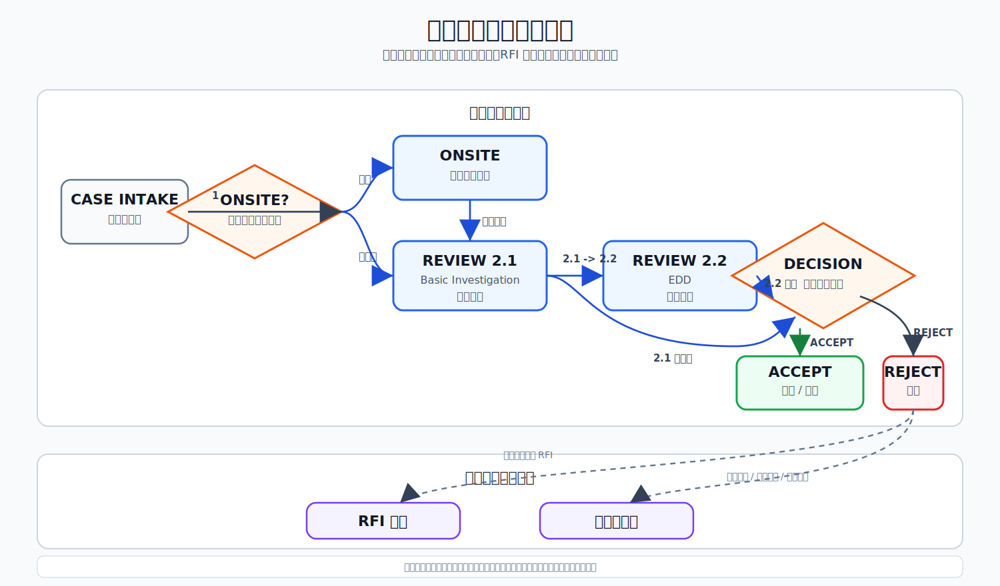

# Case Disposition State Flow

## SVG Diagram

## State Boundary

Primary case states are limited to investigation stages and final disposition results.

RFI response and strategy-team feedback are follow-up tasks. They are not primary case states because they can be conditional, optional, and parallel.
