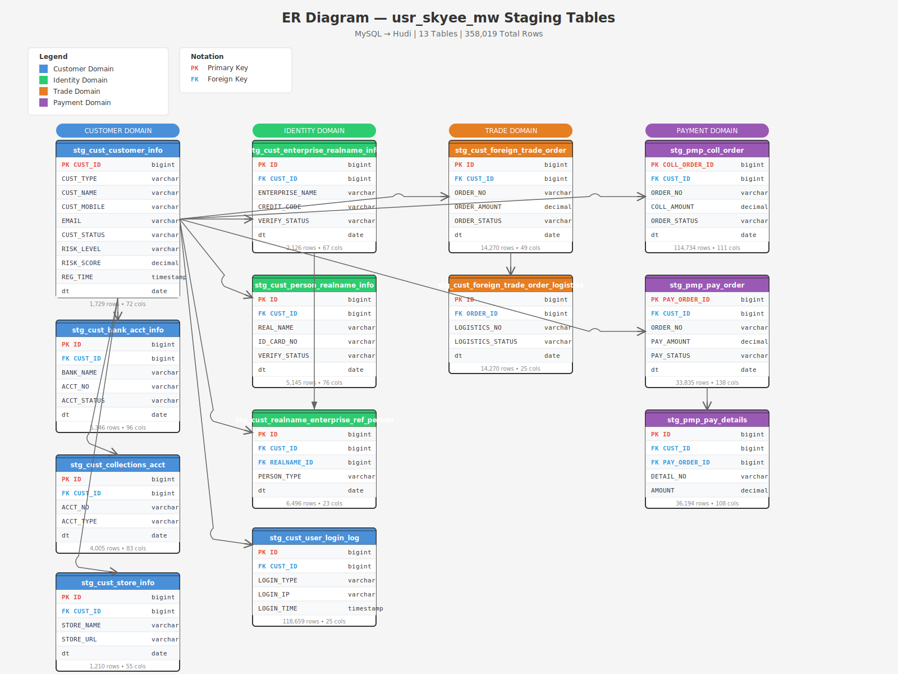
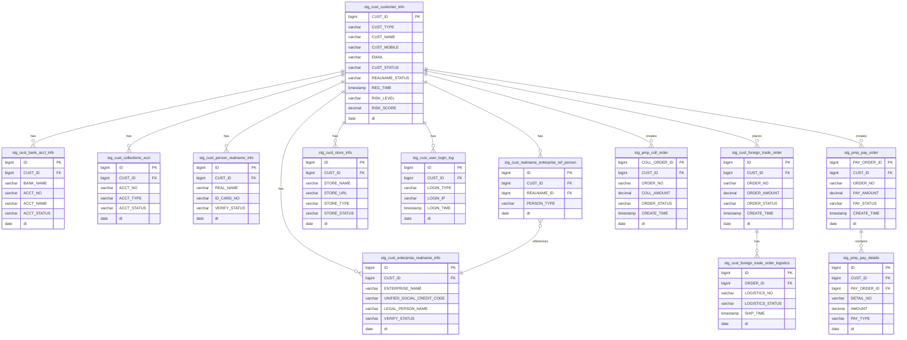

# ER Diagram — usr_skyee_mw Staging Tables

## Visual ER Diagram

## Mermaid ER Diagram

## Key Relationships

| Relationship | Type | Description |
|--------------|------|-------------|
| `stg_cust_customer_info` → `stg_cust_bank_acct_info` | 1:N | Customer has bank accounts |
| `stg_cust_customer_info` → `stg_cust_collections_acct` | 1:N | Customer has collection accounts |
| `stg_cust_customer_info` → `stg_cust_enterprise_realname_info` | 1:N | Customer has enterprise realname records |
| `stg_cust_customer_info` → `stg_cust_person_realname_info` | 1:N | Customer has person realname records |
| `stg_cust_customer_info` → `stg_cust_store_info` | 1:N | Customer has stores |
| `stg_cust_customer_info` → `stg_cust_user_login_log` | 1:N | Customer has login logs |
| `stg_cust_customer_info` → `stg_cust_foreign_trade_order` | 1:N | Customer places foreign trade orders |
| `stg_cust_customer_info` → `stg_pmp_coll_order` | 1:N | Customer creates collection orders |
| `stg_cust_customer_info` → `stg_pmp_pay_order` | 1:N | Customer creates payment orders |
| `stg_cust_foreign_trade_order` → `stg_cust_foreign_trade_order_logistics` | 1:N | Order has logistics records |
| `stg_pmp_pay_order` → `stg_pmp_pay_details` | 1:N | Payment order has details |
| `stg_cust_enterprise_realname_info` → `stg_cust_realname_enterprise_ref_person` | 1:N | Enterprise realname has referenced persons |

## Domain Grouping

### Customer Domain
- `stg_cust_customer_info` — Core customer master data
- `stg_cust_bank_acct_info` — Customer bank accounts
- `stg_cust_collections_acct` — Customer collection accounts
- `stg_cust_store_info` — Customer stores/platforms
- `stg_cust_user_login_log` — Customer login history

### Identity Domain
- `stg_cust_enterprise_realname_info` — Enterprise realname verification
- `stg_cust_person_realname_info` — Person realname verification
- `stg_cust_realname_enterprise_ref_person` — Enterprise-person references

### Trade Domain
- `stg_cust_foreign_trade_order` — Foreign trade orders
- `stg_cust_foreign_trade_order_logistics` — Logistics for trade orders

### Payment Domain
- `stg_pmp_coll_order` — Collection orders
- `stg_pmp_pay_order` — Payment orders
- `stg_pmp_pay_details` — Payment order line items

## Primary Keys

| Table | Primary Key | Type |
|-------|-------------|------|
| stg_cust_customer_info | CUST_ID | bigint |
| stg_cust_bank_acct_info | ID | bigint |
| stg_cust_collections_acct | ID | bigint |
| stg_cust_enterprise_realname_info | ID | bigint |
| stg_cust_person_realname_info | ID | bigint |
| stg_cust_realname_enterprise_ref_person | ID | bigint |
| stg_cust_store_info | ID | bigint |
| stg_cust_user_login_log | ID | bigint |
| stg_cust_foreign_trade_order | ID | bigint |
| stg_cust_foreign_trade_order_logistics | ID | bigint |
| stg_pmp_coll_order | COLL_ORDER_ID | bigint |
| stg_pmp_pay_order | PAY_ORDER_ID | bigint |
| stg_pmp_pay_details | ID | bigint |

## Table Statistics

| Table | Rows | Columns | Domain |
|-------|------|---------|--------|
| stg_cust_customer_info | 1,729 | 72 | Customer |
| stg_cust_bank_acct_info | 5,346 | 96 | Customer |
| stg_cust_collections_acct | 4,005 | 83 | Customer |
| stg_cust_enterprise_realname_info | 2,126 | 67 | Identity |
| stg_cust_person_realname_info | 5,145 | 76 | Identity |
| stg_cust_realname_enterprise_ref_person | 6,496 | 23 | Identity |
| stg_cust_store_info | 1,210 | 55 | Customer |
| stg_cust_user_login_log | 118,659 | 25 | Customer |
| stg_cust_foreign_trade_order | 14,270 | 49 | Trade |
| stg_cust_foreign_trade_order_logistics | 14,270 | 25 | Trade |
| stg_pmp_coll_order | 114,734 | 111 | Payment |
| stg_pmp_pay_order | 33,835 | 138 | Payment |
| stg_pmp_pay_details | 36,194 | 108 | Payment |
| **Total** | **358,019** | | |
